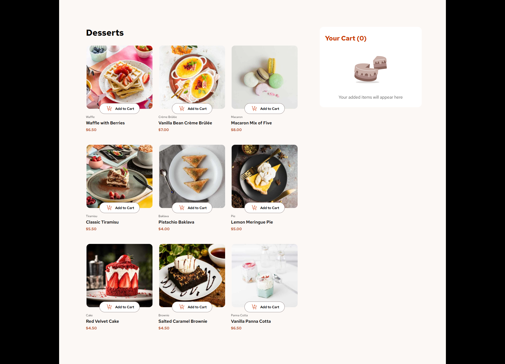

<h1 align="center"> DessertShop 💻 </h1>

## Status 🔧

I'm currently working on this project. It still misses the last 3 requirements, the others were achieved.

## Requirements 📄

These are the requirements for this project from frontendMentor challenges:

- Add items to the cart and remove them
- Increase/decrease the number of items in the cart
- See an order confirmation modal when they click "Confirm Order"
- Reset their selections when they click "Start New Order"
- Navigate the whole project and perform all actions using only their keyboard
- View the optimal layout for the interface depending on their device's screen size
- See hover and focus states for all interactive elements on the page

## Alerts ⚡

- > [FrontendMentor Challenge Page](https://www.frontendmentor.io/challenges/product-list-with-cart-5MmqLVAp_d)

- > [Live Project Link](https://dessertin.netlify.app/)

## Goal 📌 

- Recover my familiarity with angular.

---

<h3 align="center"> Home 📷 </h3>

    

<h3 align="center"> Tecnologias utilizadas 🤖 </h3>

 > 

 >   
 >   
 > 

